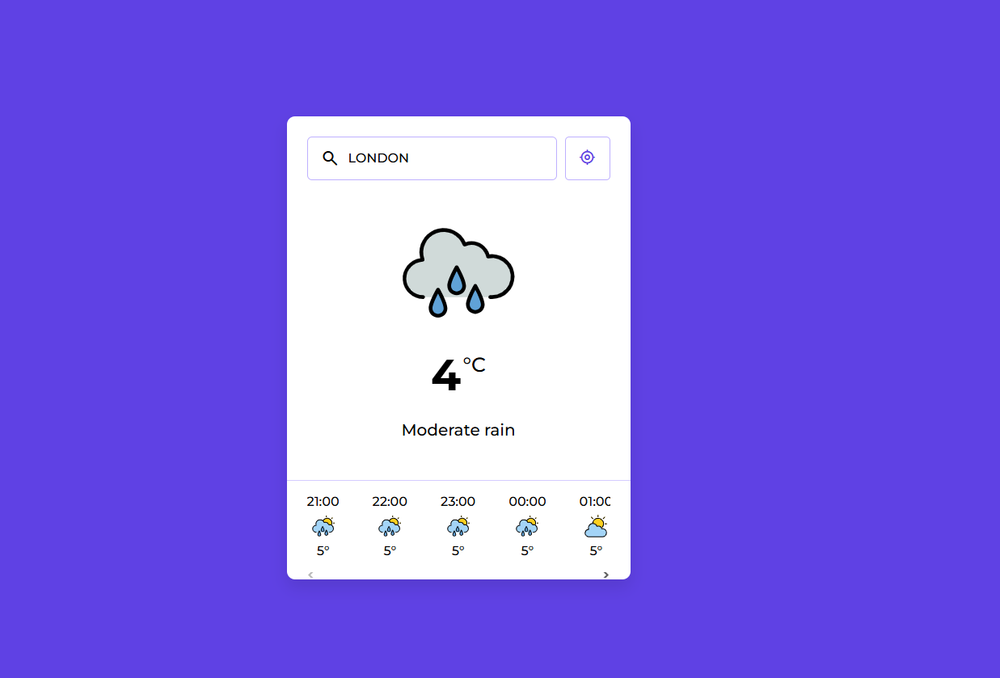

## 🌤️ Weather App Preview



# 🌤️ Weather App – Kurulum ve API Anahtarı Ayarları

Bu proje, hava durumu verilerini almak için WeatherAPI servisini kullanmaktadır. Uygulamayı sorunsuz bir şekilde çalıştırabilmek için kişisel bir API anahtarı gereklidir.

Projeyi çalıştırmadan önce https://www.weatherapi.com adresine giderek ücretsiz bir hesap oluşturmanız gerekmektedir. Kayıt işlemini tamamladıktan sonra hesabınıza giriş yapın ve Dashboard bölümünde size özel oluşturulan API Key’i kopyalayın.

Daha sonra proje klasöründe bulunan `script.js` dosyasını açın ve 6. satırda belirtilen API anahtarı alanına kendi anahtarınızı yapıştırın. Örnek kullanım aşağıdaki gibidir:

```javascript
const API_KEY = "BURAYA_KENDI_API_KEYINIZI_YAPISTIRIN";

API anahtarınızı ekledikten sonra dosyayı kaydedin ve index.html dosyasını tarayıcıda açarak projeyi çalıştırabilirsiniz. İsterseniz Live Server gibi bir geliştirme eklentisi de kullanabilirsiniz.
```

---

# 🌤️ Weather App – Setup and API Key Configuration

In order to run the application properly, you need a personal API key.

Before running the project, please visit https://www.weatherapi.com and create a free account. After completing the registration process, log in to your account and navigate to the Dashboard section. There, you will find your unique API Key. Copy this key.

Next, open the `script.js` file located in the project folder and paste your API key into the specified area on line 6. An example is shown below:

```javascript
const API_KEY = "PASTE_YOUR_OWN_API_KEY_HERE";

After adding your API key, save the file and open the index.html file in your browser to run the project. You may also use a development extension such as Live Server if preferred.
```
